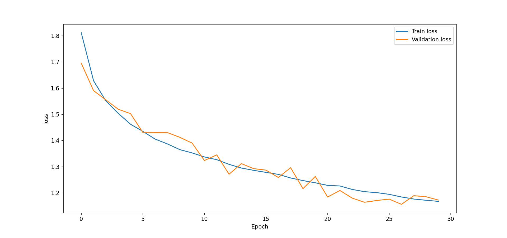
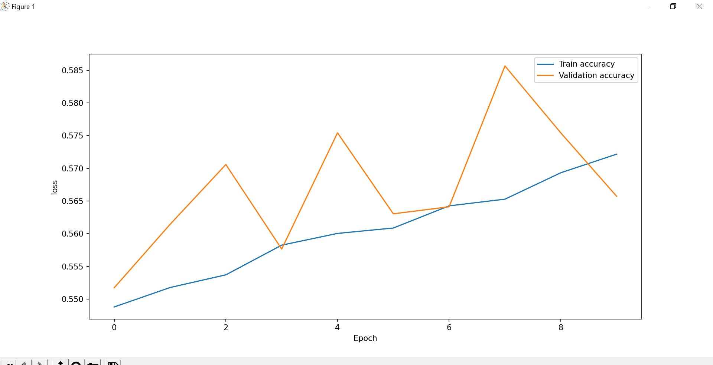
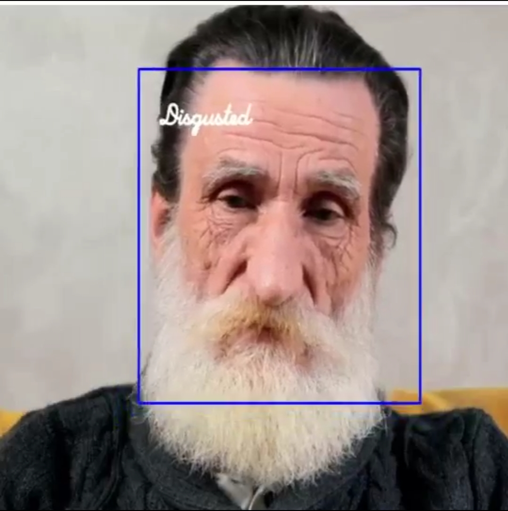

# Emotion Recognition with TensorFlow and OpenCV

## Overview

This project aims to recognize human emotions using TensorFlow and OpenCV. The emotion recognition model was trained on a dataset containing seven human emotions. The primary libraries used in this project are TensorFlow and OpenCV.

## Dataset

The dataset consists of a curated collection of images representing seven human emotions. Images were preprocessed to ensure consistent data quality.

## Training

- **Library Used:** TensorFlow, OpenCV
- **Training Time:** Approximately 2 hours
- **Epochs:** 30
- **Steps per Epoch:** 600
- **Batch Size:** 64

During training, a total of 40,145 images were used from various internet sources and datasets. The model achieved a training accuracy of 64% and a testing accuracy of 60%.

## Loss comparisson


## Folder structure 
 ```bash
project-root/
├── em1.py
├── detect_casc.py
├── train/
│   ├── 0_Angry/
│   ├── 1_Disgusted/
│   ├── 2_Fearful/
│   ├── 3_Happy/
│   ├── 4_Neutral/
│   ├── 5_Sad/
│   ├── 6_Surprised/
│   ├── clean_f.py
│   ├── clean_f_tobw.py
│   ├── imghash.py
│   ├── png_jpeg.py
│   ├── reduce_no.py
│   └── resize.py
├── test/
│   ├── 0_Angry/
│   ├── 1_Disgusted/
│   ├── 2_Fearful/
│   ├── 3_Happy/
│   ├── 4_Neutral/
│   ├── 5_Sad/
│   ├── 6_Surprised/
│   ├── clean_f.py
│   ├── clean_f_tobw.py
│   ├── imghash.py
│   ├── png_jpeg.py
│   ├── reduce_no.py
│   └── resize.py
└── validation/
    ├── 0_Angry/
    ├── 1_Disgusted/
    ├── 2_Fearful/
    ├── 3_Happy/
    ├── 4_Neutral/
    ├── 5_Sad/
    ├── 6_Surprised/
    ├── clean_f.py
    ├── clean_f_tobw.py
    ├── imghash.py
    ├── png_jpeg.py
    ├── reduce_no.py
    └── resize.py
 ```


## Usage

To use the emotion recognition model, follow these steps:

1. Download

Scripts

Note : files 1 to 7 should placed inside train, test and validation folder and last two is in the main folder

1. To detect faces and remove other images using mediapipe, draw bboxes(not necessary)
    
    ```bash
    python clean_f.py
    ```
2. convert to B&W images and find images with faces using mediapipe, draw bboxes(not necessary)
   
    ```bash
    python clean_f_tobw.py
    ```
3. To remove duplicate images

   ```bash
    python imghash.py
    ```
5. convert to jpeg format

    ```bash
    python png_jpeg.py
    ```
6. To balance training image in each emotion folder --> choose wisely

   ```bash
    python reduce_no.py
    ```
7. Bulkily resize images to specific size

   ```bash
    python resize.py
    ```
8. To train your data
   
    ```bash
    python em1.py
    ```
    
9. Run and display the emotion recognition script:

    ```bash
    python detect_casc.py
    ```

## Results

- **Training Accuracy:** 64%
- **Testing Accuracy:** 60%

### Train and vlidation comparison


### sample out


## Contributors

- [Albpy](https://github.com/albpy/Emotion-detection)

## License

This project is licensed under the [MIT License](LICENSE).

## Acknowledgments

- Special thanks to the creators of TensorFlow and OpenCV for their powerful tools and resources.
